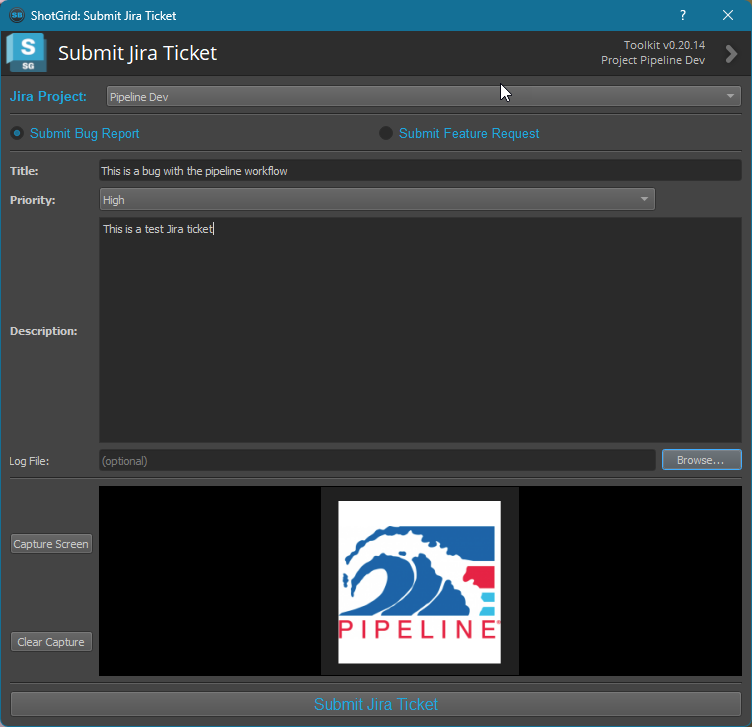
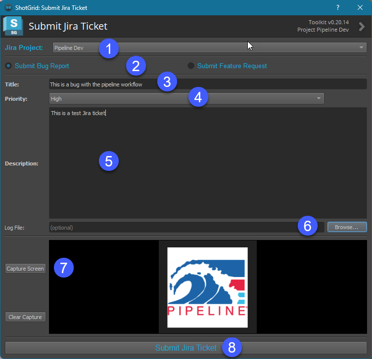
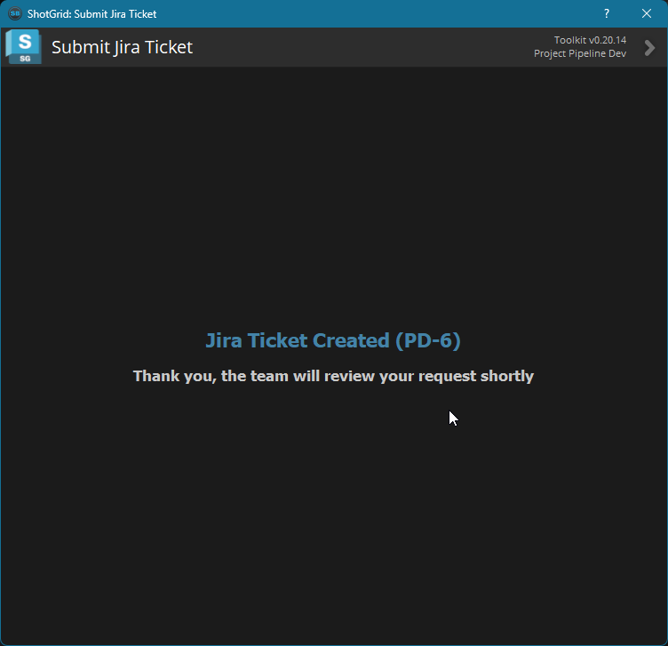

# Welcome to the Submit Jira Ticket Toolkit App

A convenient ShotGrid Toolkit app that allows Artists to submit Jira tickets directly from ShotGrid Desktop or a DCC 

This app runs in both ShotGrid Desktop and in DCCs allowing artists and production staff to create Jira Tickets at will. 
The app config.yml file allows the app to be configured for the particular naming standards needs of the project:

- Support for multiple Jira projects so tickets can be directed to a specific project
- Support for creating either Bug tickets or Feature Request Tickets
- Customizable Ticket Priorities to match your Jira site
- Ability to take screenshots and include them in the Jira Ticket
- Ability to attach a log file to the Jira Ticket

I would love to hear feedback about this app, any feature requests or bugs you might encounter. Feel free to message me directly or leave a message on Github.

#### Cheers,
#### Scott Ballard
* scott@scottballard.net
* https://www.linkedin.com/in/scottballard

***
## Using the App

1. Select the Jira Project you'd like to submit the ticket for
2. Select which type of ticket you'd like to create; Bug Report or Feature Request
3. Give the Ticket a title
4. Select Priority of the ticket
5. Give a detailed description for the ticket so the developers can address the bug or feature request
6. Optionally, attached a log file to the Ticket
7. Optionally, take a screenshot of the bug or feature request to attach to the ticket
8. Submit the Ticket to Jira

Once the Artist submits a ticket the following screen with the Ticket id will be presented to them

***
## Installation
If you want to get up and running quickly, follow this simple step:
* tank install_app Project tk-desktop https://github.com/scottb08/sb-jira-createticket

### Manual Installation
The app contains a folder called `setup` which contains a sample `sb-jira-createticket.yml` file which contains app settings. 
Drop this into your Toolkit `config\env\includes\settings` folder, then add the app to SG Desktop and/or DCCs.
